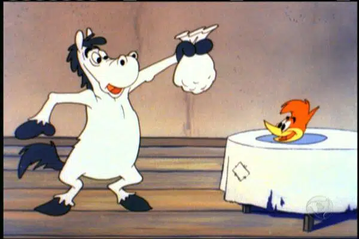

<!DOCTYPE html>
<html lang="pt-br">
<head>
    <meta charset="UTF-8">
    <meta name="viewport" content="width=device-width, initial-scale=1.0">
    <link rel="stylesheet" href="style.css">
    <title>Formulario de cadastro</title>
</head>
<body>
    

        

            
        

        

                <form action="#">
                    

                        

                            <h1>cadastre-se</h1>
                        

                        

                            <button><a href="pagina2.html">Entrar</a></button>
                        

                    

                   

                    

                        <label for="firstname">Primeiro nome</label>
                        <input id="firstname" type="text" name="firstname" placeholder="Digite seu primeiro nome" required>
                    

                    

                        <label for="lastname">Sobrenome</label>
                        <input id="lastname" type="text" name="lastname" placeholder="Digite seu Sobrenome" required>
                    

                    

                        <label for="email">Primeiro nome</label>
                        <input id="email" type="email" name="email" placeholder="Digite seu email" required>
                    

                    

                        <label for="number">Celular</label>
                        <input id="number" type="tel" name="number" placeholder="(xx) xxxx-xxxx" required>
                    

                    

                        <label for="password">Senha</label>
                        <input id="password" type="password" name="password" placeholder="Digite sua senha" required>
                    

                    

                        <label for="password">Confirme sua senha</label>
                        <input id="password" type="password" name="Confirmpassword" placeholder="Digite sua senha" required>
                    

                   
 

                    

                        

                            <h6>Genero</h6>
                        

                        

                            

                                <input type="radio" id="female" name="gender">
                                <label for="female">Feminino</label>
                            

                        

                            

                                <input type="radio" id="male" name="gender">
                                <label for="male">Masculino</label>
                            

                        

                        

                            

                                <input type="radio" id="others" name="gender">
                                <label for="others">Outros</label>
                            

                        

                            

                                <input type="radio" id="none" name="gender">
                                <label for="none">Prefiro nao dizer</label>
                            
        
                    
 

                    

                        <button><a href="pagina2.html">Continuar</a></button>
                    

                </form>
        

    

</body>
</html># PicaPau

<!DOCTYPE html>
<html lang="pt-br">
<head>
    <meta charset="UTF-8">
    <meta name="viewport" content="width=device-width, initial-scale=1.0">
    <link rel="stylesheet" href="style2.css">
    <title>Pica Pau</title>
</head>
<body> 

            

            

                <h1>Mapa onde se habitava o Pica Pau na vida real</h1>
            

            <iframe width="425" height="350" src="https://www.openstreetmap.org/export/embed.html?bbox=-91.53327941894533%2C32.072974629252435%2C-91.08009338378906%2C32.33384903829444&amp;layer=mapnik" style="border: 1px solid black"></iframe> <small><a href="https://www.openstreetmap.org/#map=12/32.2035/-91.3067">Ver mapa ampliado</a></small>
            

            

                

                    <h3>O Pica-Pau tem, possivelmente, o riso mais famoso da história dos desenhos animados: o seu inconfundível “hehehehe’! Um pássaro que, como sempre, é muito rápido, imprevisível e muito engraçado.
                    O personagem foi criado por Walter Lanz há mais de 80 anos, precisamente em 1940, durante sua viagem de lua de mel. Um dia, enquanto chovia, ouviu um insistente Pica-Pau que não parava de bicar seu telhado. Ele achou tão irritante que pensou que um desenho como esse poderia irritar seus outros personagens.
                    </h3>
                

                

                
                

                

                    <h2>Quem foi o criador de Pica-Pau?</h2>
                    <h3>Walter Lantz nasceu em 1899, em New Rochelle, em Nova York, mas aos 15 anos, mudou-se para Manhattan. Então, começou a trabalhar como mensageiro e entregador para um doa maiores jornais da época.
                    </h3>
                

            

            

                <h2>Assista ao Iconico desenho Pica-Pau</h2>
                <iframe width="560" height="315" src="https://www.youtube.com/embed/3sdgblNfFMU" frameborder="0" allow="accelerometer; autoplay; encrypted-media; gyroscope; picture-in-picture" allowfullscreen></iframe>
            

    

</body>
</html>
@import url('https://fonts.googleapis.com/css2?family=Roboto+Mono:ital,wght@0,100..700;1,100..700&display=swap');
* {
    padding: 0;
    margin: 0;
    box-sizing: border-box;
    font-family: 'Roboto Mono';
}

body {
    width: 100%;
    height: 100vh;
    display: flex;
    justify-content: center;
    align-items: center;
    background: #B22222;
}

.container {
    width: 80%;
    height: 80vh;
    display: flex;
    box-shadow: 5px 5px 10px rgba(0, 0, 0, .212);
}

.form-image {
    width: 50%;
    display: flex;
    justify-content: center;
    align-items: center;
    background-color: #B22222;
    padding: 1rem;
}

.form {
    width: 50%;
    display: flex;
    justify-content: center;
    align-items: center;
    flex-direction: column;
    background-color: #A52A2A;
    padding: 3rem;
}
.form-header {
    margin-bottom: 3rem;
    display: flex;
    justify-content: space-between;
}

.login-button {
    display: flex;
    align-items: center;
}

.login-button button {
    border: none;
    background-color: #FA8072;
    padding: 1rem 3rem;
    border-radius: 5px;
    cursor: pointer;
}

.login-button button a {
    text-decoration: none;
    font-size: 0.92rem;
    font-weight: 500;
    color: #fff;
}

.form-header h1::after{
    content: '';
    display: block;
    width: 5rem;
    height: 0.3rem;
    background-color: blanchedalmond;
    position: absolute;
    border-radius: 10px;
}

.input-group {
    display: flex;
    flex-wrap: wrap;
    justify-content: space-between;
    padding: 1rem;
}

.input-box {
    display: flex;
    flex-direction: column;
    margin-bottom: 1.1rem;
}

.input-box input {
    margin: 0.6rem 0;
    padding: 0.8rem 1.2rem;
    border: none;
    border-radius: 10px;
    box-shadow: 1px 1px 6px #0000001c;
}

.input-box input:focus-visible {
    outline: 1px solid blanchedalmond;
}

.input-box label,
.gender-title h6 {
    font-size: 0.75rem;
    font-weight: 600;
    color: #000000c0;
}
.input-box input::placeholder {
    color: #000000be;
}

.gender-group {
    display: flex;
    justify-content: space-between;
    margin-top: 0.62rem;
    padding: 0 0.5rem;
}

.gender-input {
    display: flex;
    align-items: center;
}

.gender-input input {
    margin-right: 0.40rem;
}

.gender-input label {
    font-size: 0.81rem;
    font-weight: 600;
    color: #f5c0c0c0;
}

.continue-button button {
    width: 100%;
    margin-top: 1rem;
    border: none;
    background-color: #FA8072;
    padding: 0.60rem;
    border-radius: 5px;
    cursor: pointer;
}

.continue-button button a {
    text-decoration: none;
    font-size: 0.92rem;
    font-weight: 500;
    color: #fff;
}
* {
   margin: 0;
   padding: 0;
   box-sizing: border-box;
}

body {
   font-family: 'Arial', sans-serif;
   background-color: #B22222;
   color: #333;
   line-height: 1.6;
   padding: 0;
   margin: 0;
}

.container {
   max-width: 1200px;
   margin: 30px auto;
   padding: 20px;
   background-color: blanchedalmond;
   border-radius: 8px;
   box-shadow: 0 4px 12px rgba(0, 0, 0, 0.1);
}

h1 {
   font-size: 28px;
   color: #333;
   margin-bottom: 20px;
   text-align: center;
}

.map {
   text-align: center;
   margin-bottom: 40px;
}

iframe {
   border-radius: 8px;
   box-shadow: 0 4px 8px rgba(0, 0, 0, 0.1);
   max-width: 100%;
   height: 350px;
}

small {
   display: block;
   margin-top: 10px;
   text-align: center;
}

small a {
   color: #3498db;
   text-decoration: none;
   font-weight: bold;
}

small a:hover {
   text-decoration: underline;
}

.text-image {
   display: flex;
   flex-wrap: wrap;
   justify-content: space-between;
   gap: 20px;
}

.text1, .text2 {
   flex: 1;
   padding: 15px;
   background-color: #B22222;
   border-radius: 8px;
   box-shadow: 0 2px 8px rgba(0, 0, 0, 0.1);
   transition: transform 0.3s ease;
}

.text1:hover, .text2:hover {
   transform: translateY(-5px);
}

.img1 {
   flex: 1;
   display: flex;
   justify-content: center;
   align-items: center;
}

.img1 img {
   max-width: 100%;
   border-radius: 8px;
   box-shadow: 0 2px 8px rgba(0, 0, 0, 0.1);
   transition: transform 0.3s ease;
}

.img1 img:hover {
   transform: scale(1.05);
}

h2 {
   font-size: 24px;
   color: #fff;
   margin-bottom: 10px;
}

h3 {
   font-size: 16px;
   color: #fff;
   line-height: 1.6;
   margin-bottom: 20px;
}

.video-container {
   margin: 40px 0;
   text-align: center;
}

.video-container iframe {
   max-width: 100%;
   border-radius: 8px;
   box-shadow: 0 4px 8px rgba(0, 0, 0, 0.1);
}
